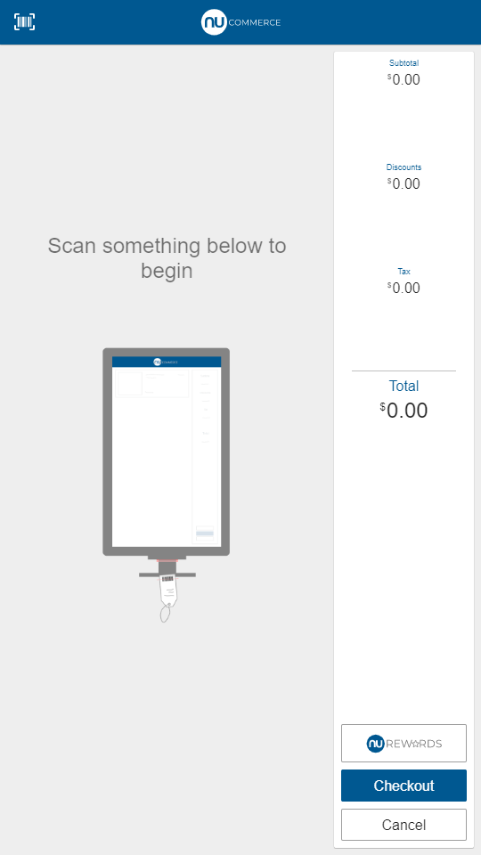
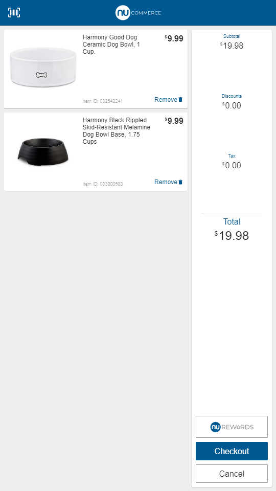

# Self Checkout Sale

The self checkout sale screen covers the main functionality of the sale and is similar to the core sale screen. Some functionality from the core sale screen is omitted from self checkout since this screen is customer facing.





## Setting the Image

The sale screen image is set via the `backgroundImage` property on the UIMessage. This can be set from the server, for example:

``` java
screen.setBackgroundImage("content:scan-item");
```

## Setting the Instructions

The instructions text is set via the `prompt` property on the UIMessage. This can be set from the server, for example:

``` java
screen.setPrompt("key:selfcheckout:sale.prompt.transactionInactive");
```

The instructions use the shared `InstructionsComponent`. This component can be styled with scss through theming or by overriding the component.

## Setting the Items

Items are set using the `items` property on the UIMessage. These items are built using the ISellItemBuilder interface from the server. For example, the `SelfCheckoutSellItemBuilder` builds the list of `SellItem` using the following method:

``` java
@Override
public List<SellItem> buildSellItems(RetailTransModel transaction, AppContext context) {
    List<RetailLineItemModel> lineItems = transaction.getRetailLineItems();
    List<SellItem> items = new ArrayList<>();

    int index = 0;
    for (RetailLineItemModel lineItem : lineItems) {
        if (!lineItem.isVoided()) {
            SellItem item = buildSellItem(lineItem, transaction, context, true, index++);
            if (item.isEnabled()) {
                items.add(item);
            }
        }
    }

    return items;
    }
```

The item list uses the shared `SaleItemCardListComponent` screen part. Styling for this component can be overriden by modifying the scss in a theme. This component can also be completely overriden with a new component by replacing the prompt `SaleItemCardListComponent` with a new screen part.

## Setting the Totals

Totals are set using the `totals` and `grandTotal` properties on the UIMessage. This can be set from the server, for example:

``` java
screen.setGrandTotal("Total", transaction.getTotal().getAmount().toString());
screen.addTotal("Subtotal", transaction.getSubtotal().getAmount().toString());
screen.addTotal("Discounts", transaction.getDiscountTotal().getAmount().toString());
screen.addTotal("Tax", transaction.getTaxTotal().getAmount().toString());
```

The totals panel uses the shared `SaleTotalPanelComponent` screen part. Styling for this component can be overriden by modifying the scss in a theme. This component can also be completely overriden with a new component by replacing the prompt `SaleTotalPanelComponent` with a new screen part.
