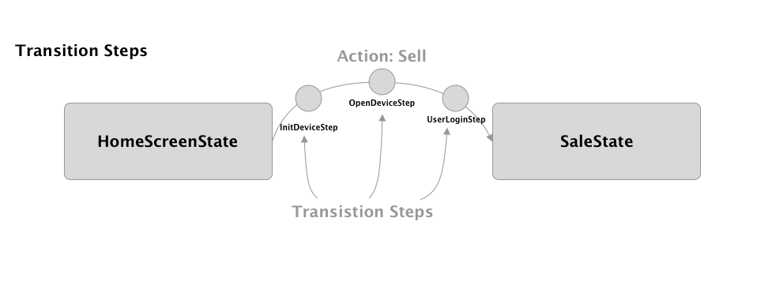

# Overview

Overall, openpos-core provides the infrastructure for defining the "flow" of a client-side retail application. It understands the steps and transitions though an application, as well as what screens to display in an abstract level.  It is **not aware** of a particular UI technology.  It says "display the sales screen with the following items" and allows the client to decide how to render that information as a screen on the UI. 

The openpos-core project contains much of what is considered the "controller" logic that resides in between the web front end client (the "view") and the business logic service code (the "model").  The core project provicdes   Specifically, core contains:

* The openpos state mahine. (The `org.jumpmind.pos.core.flow` package.)
* UIMessages such as HomeUIMessage, DialogUIMessage are abstracted screen types.
* Abstracted UI component models which make up the form screens (e.g. FormField, DateField, RadioField, etc., in the `org.jumpmind.pos.core.model` package)
* ScreenInterceptors are like filters which get run on each screen model before it is passed to the client.
* Screen templates (e.g. SellTemplate) are higher level templates for commonly used screen layouts.

# Key Classes
* **SessionSubscribedListener** - invoked by Spring when a new client connects over stomp.
* **StateManager** - dictates what the current screen of the application should be and handles actions as they come in.
* **ScreenService** - the screen service works with the MessageService to a) send screens to the client as JSON stompe messages and b) receive Actions from the client in the form of Json messages.
* **UIMessage** - represents a message (usually a screen) that is sent to the client.

# State Machine

The state machine is responsible for the "state" of a client application. 

## State machine concepts

### State: 
What state the application is in. (E.g. HomeScreenState) The state machine transitions from state to state.

A state can be represented by any java class and includes at least one method annotated with @OnArrive.

~~~~
public class HomeState {
    @OnArrive
    public void arrive(Action action) {
        showScreen();
    }
    ...
}
~~~~

States can also **inject** services, Spring beans or scoped context values.  

Services and Spring beans are typically injected using the `@Autowired` annotation.
~~~~
public class HomeState {

    @Autowired
    private IUserService userService;

    @OnArrive
    public void arrive(Action action) {
        showScreen();
    }
    ...
}
~~~~

Scoped context values represent values which need to be held in memory and shared between states.  The currently logged in user or current transaction are common exmamples

TODO describe the scopes here.

States and their transitions are represented in "flow" yaml config files.  Consider this example"

~~~~
---
DefaultFlow:
  - HomeState: 
      Sell: SaleState
      Returns: ReturnState
  - SaleState:
      Back: HomeState
  - ReturnState:
      Back: HomeState      
~~~~

This flow config has the following semantics:
* The DefaultFlow will start on the HomeState because it's the first state list.
* On the HomeState, when the "Sell" action is encountered, transtion to the SaleState.  If the "Returns" action is encountered, transition to the "ReturnState".
* When on the SaleState, if the "Back" action is encountered, transition to the HomeState.
* When on the SalReturnStateState, if the "Back" action is encountered, transition to the HomeState.

### Action

**Actions**: these are events generated either by the client or by server side state logic.  (e.g. UsernameEntered).  Actions always have a name and can have an optional payload (data) which is usually a string or a Map structure.

### TransitionStep

Steps which execute during the transition from one state to another and can show screens and cancel the transition if necessary. Transition steps are good for cross-cutting needs such as ensuring a user is logged in or the device is open, for example.

### Substate / Subflows

TODO diagram and explain sub flows.

